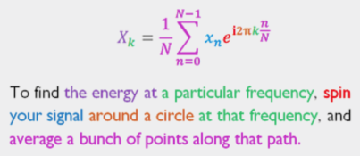

#色彩标注法
Stuart Riffle给出了对傅里叶变换的一个绝佳解释。在他的公布内容中有许多精彩的图片，但是其中的顶点是他关于离散傅里叶逆变换公式的解释：

真是一个棒极了的展示！我的第一个想法是，更多的方程式应该有这样专注于读者理解的优雅的解释上。我希望能够以这种风格来给出如此清晰的解释：

$$\textcolor{Purple}{X}_\textcolor{Green}{k}
=\textcolor{Magenta}{\frac{1}{N}\sum_{n=0}^{N-1}}
\textcolor{Blue}{x_n}
\textcolor{Red}{e}^
{\textcolor{Red}{i}\textcolor{Orange}{2\pi} 
\textcolor{Green}{k}
\textcolor{Magenta}{\frac{n}{N}}
}.$$

为了发现 特定频率下的能量， 以那个频率环绕一个圆 , 旋转你的信号，并且沿着该路径平均地分配一束点。

**Remark:**

1. Html color setting  
		Blue 
		 Brown 
		 Cyan 
		 Green 
		 Grey 
		 Magenta 
		 Orange 
		 Yellow 
		 Purple 
2. The raw equation is $$X_k=\frac{1}{N}\sum_{n=0}^{N-1}x_ne^{i2\pi k \frac{n}{N}}.$$
3. Reference: [Colorful Equations With MathJax](http://adereth.github.io/blog/2013/11/29/colorful-equations/)